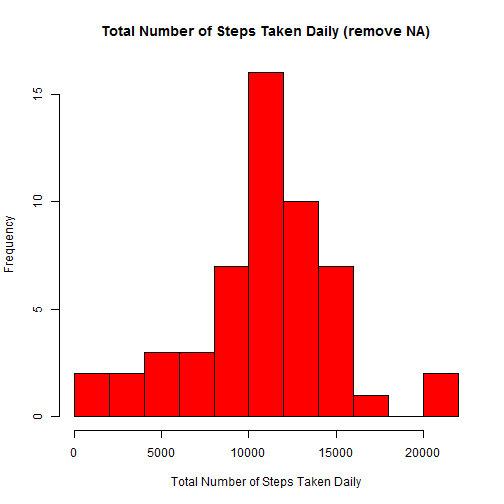
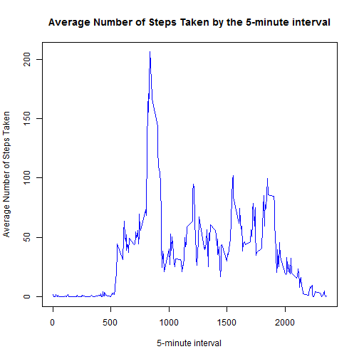
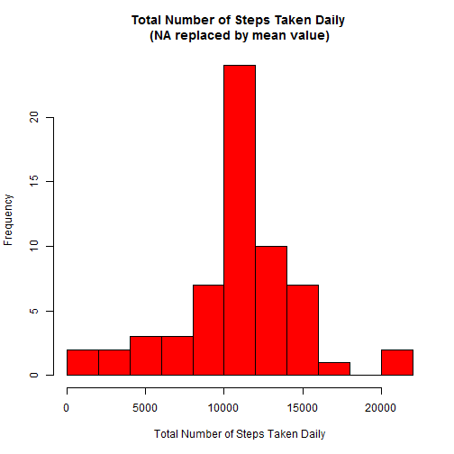

Reproducible Research: Peer Assessment 1
===========================================
##Introduction

It is now possible to collect a large amount of data about personal movement using activity monitoring devices such as a Fitbit, Nike Fuelband, or Jawbone Up. These type of devices are part of the "quantified self" movement - a group of enthusiasts who take measurements about themselves regularly to improve their health, to find patterns in their behavior, or because they are tech geeks. But these data remain under-utilized both because the raw data are hard to obtain and there is a lack of statistical methods and software for processing and interpreting the data.

This assignment makes use of data from a personal activity monitoring device. This device collects data at 5 minute intervals through out the day. The data consists of two months of data from an anonymous individual collected during the months of October and November, 2012 and include the number of steps taken in 5 minute intervals each day.
Data

The dataset is stored in a comma-separated-value (CSV) file and there are a total of 17,568 observations in this dataset.

###Loading and preprocessing the data
The downloaded data is in zipped file format. Firstly, unzip the data. Then read the data into R.


```r
unzip("activity.zip")
activity <- read.csv("activity.csv", header =TRUE, stringsAsFactors =FALSE)
```

The activity dataset consists of three variables:

* **steps**: Number of steps taking in a 5-minute interval (missing values are coded as NA)

* **date**: The date on which the measurement was taken in YYYY-MM-DD format

* **interval**: Identifier for the 5-minute interval in which measurement was taken


Let's look at the summary of the data:

```r
str(activity)
```

```
## 'data.frame':	17568 obs. of  3 variables:
##  $ steps   : int  NA NA NA NA NA NA NA NA NA NA ...
##  $ date    : chr  "2012-10-01" "2012-10-01" "2012-10-01" "2012-10-01" ...
##  $ interval: int  0 5 10 15 20 25 30 35 40 45 ...
```

The date in the activity dataset is in char format. Thus, we changed it to date format using as.Date():

```r
activity$date = as.Date(activity$date,"%Y-%m-%d")
```

Check on the summary of the data again. The date is now in date format:

```r
str(activity)
```

```
## 'data.frame':	17568 obs. of  3 variables:
##  $ steps   : int  NA NA NA NA NA NA NA NA NA NA ...
##  $ date    : Date, format: "2012-10-01" "2012-10-01" ...
##  $ interval: int  0 5 10 15 20 25 30 35 40 45 ...
```

###What is mean total number of steps taken per day?
For this part of the assignment, we are going to ignore the missing values in the dataset.We are interested in calculating the total number of steps taken per day. We can count the sum of the steps taken per day by using the aggregate function.
Rename the aggregate data (per_day) into date and total_steps:


```r
activity_noNA <-activity[!is.na(activity$steps),]
per_day <- aggregate(activity_noNA$steps, list(activity_noNA$date), sum)
names(per_day)<- c("date","total_steps")
```

Let's have a look at the graph of the total number of steps taken each day (in histogram):

```r
hist(per_day$total_steps,breaks =10,  main ="Total Number of Steps Taken Daily (remove NA)",xlab ="Total Number of Steps Taken Daily", col ="Red")
```

 

The mean of the total number of steps taken per day is **10766.19** and 
the median of the total number of steps taken per day is **10765**

```r
na_rm_mean <-mean(per_day$total_steps)
na_rm_median <-median(per_day$total_steps)
na_rm_mean 
```

```
## [1] 10766.19
```

```r
na_rm_median
```

```
## [1] 10765
```
###What is the average daily activity pattern?
In order to produce a time series plot of the 5-minute interval (x-axis) and the average number of steps taken, averaged across all days (y-axis), we will need to aggregate the mean of the steps by interval using the aggregate function.
The aggregate data is renamed to steps and interval_mean:

```r
by_interval <-aggregate(activity_noNA$steps, list(activity_noNA$interval),mean)
names(by_interval)<- c("interval","steps_mean")
plot(by_interval, type ="l", col = "Blue", 
     main ="Average Number of Steps Taken by the 5-minute interval", 
     xlab ="5-minute interval",ylab="Average Number of Steps Taken")
```

 

The maximum number of steps of Which 5-minute interval, on average across all the days in the dataset is **835**:

```r
max_steps <- by_interval[which.max(by_interval$steps_mean),"interval"]
max_steps
```

```
## [1] 835
```

###Imputing missing values
Note that there are a number of days/intervals where there are missing values (coded as NA). The presence of missing days may introduce bias into some calculations or summaries of the data. 

The calculated the total number of missing values in the dataset is **2304**:

```r
isna <- nrow(activity[is.na(activity$steps),])
isna
```

```
## [1] 2304
```

Create another set of activity data into activity_rep.Filling the NA values with the mean of the steps:

```r
activity_rep <- activity
mean_check <-mean(activity_rep$steps,na.rm=TRUE)
mean_check
```

```
## [1] 37.3826
```

```r
activity_rep$steps[is.na(activity_rep$steps)]<- mean(activity_rep$steps,na.rm=TRUE)
```

Let's have a look at subset of activity_rep data using head(). Notice that some the NA is being replaced by the mean of the steps:

```r
head(activity_rep)
```

```
##     steps       date interval
## 1 37.3826 2012-10-01        0
## 2 37.3826 2012-10-01        5
## 3 37.3826 2012-10-01       10
## 4 37.3826 2012-10-01       15
## 5 37.3826 2012-10-01       20
## 6 37.3826 2012-10-01       25
```

We will need to aggregate the mean of the steps by interval using the aggregate function.The aggregate data is renamed to steps and interval_mean.Then, make a histogram of the total number of steps taken each day 

```r
per_day_rep <- aggregate(activity_rep$steps, list(activity_rep$date), sum)
names(per_day_rep) <- c("date","steps")
hist(per_day_rep$steps, breaks =10, main="Total Number of Steps Taken Daily \n(NA replaced by mean value)",
     xlab ="Total Number of Steps Taken Daily", col ="Red")
```

 

The mean of the total number of steps taken per day is **10766.19** and the median of the total number of steps taken per day is **10766**:

```r
na_rp_mean <-mean(per_day_rep$steps)
na_rp_median <-median(per_day_rep$steps)
```


The **mean** remained the **same** for both but the **median** is **higher** for the data where NA is being replaced by the mean value.

###Are there differences in activity patterns between weekdays and weekends?
Using the weekdays() to convert date into week name. Then column bind the week name into activity_rep dataset. Create another type_week to differentiate the weekend and the weekday and column bind it to the activity_rep dataset:

```r
act_weekday <-weekdays(activity_rep$date)
activity_rep <- cbind(activity_rep, act_weekday)
type_week<-ifelse(activity_rep$act_weekday %in% c("Monday","Tuesday","Wednesday","Thursday","Friday"),"Weekday","Weekend")
activity_rep <- cbind(activity_rep, type_week)
```

Let's take a look at the sample data :

```r
head(activity_rep)
```

```
##     steps       date interval act_weekday type_week
## 1 37.3826 2012-10-01        0      Monday   Weekday
## 2 37.3826 2012-10-01        5      Monday   Weekday
## 3 37.3826 2012-10-01       10      Monday   Weekday
## 4 37.3826 2012-10-01       15      Monday   Weekday
## 5 37.3826 2012-10-01       20      Monday   Weekday
## 6 37.3826 2012-10-01       25      Monday   Weekday
```

Use aggregate() to count the mean of the steps by the type of week(weekday or weekend) and the interval. Rename the dataset to type_week, interval and mean

```r
mean_week <- aggregate(activity_rep$steps, 
                       by=list(activity_rep$type_week, 
                               activity_rep$interval), mean)

names(mean_week)<- c("type_week","interval","mean")
```

Make a panel plot containing a time series plot (i.e. type = "l") of the 5-minute interval (x-axis) and the average number of steps taken, averaged across all weekday days or weekend days (y-axis):

```r
library(lattice)
xyplot(mean_week$mean ~ mean_week$interval | mean_week$type_week,
       type="l", 
       lwd=1, 
       xlab="Interval", 
       ylab="Number of steps", 
       layout=c(1,2))
```

 

End of Page
